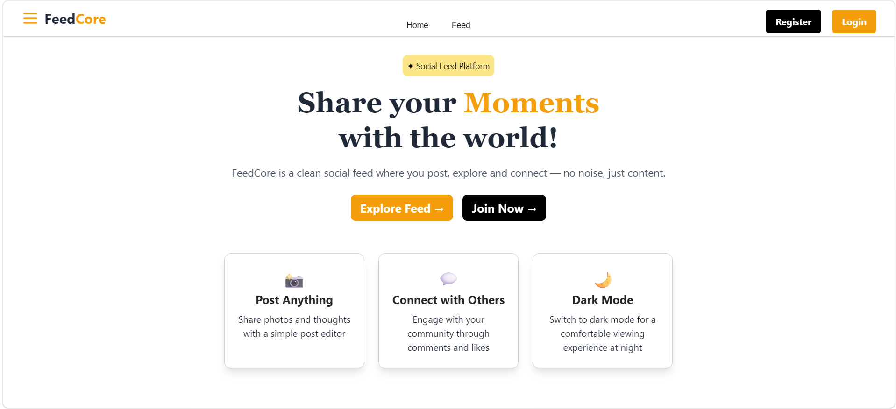
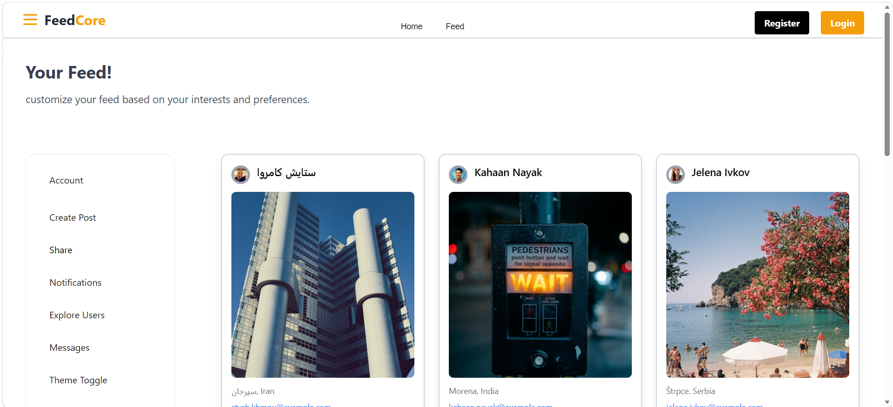
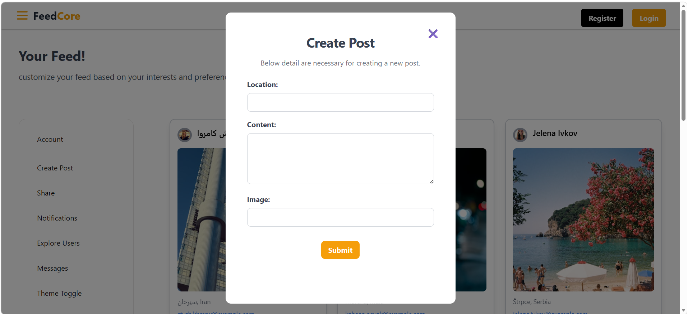

# FeedCore — Social Feed Web Application

A social-feed web application built using **HTML, CSS, Tailwind CSS, and JavaScript** as a learning project.

## 📸 Screenshots

### Home



### Feed



### Create Post



## ✨ Features

* Dynamic social feed
* User cards and user information
* Create post functionality
* Login and registration
* Form validation
* API integration
* Modal interactions
* Notifications
* Responsive UI

## 🛠️ Technologies

* HTML5
* CSS3
* Tailwind CSS
* JavaScript
* REST APIs

## 🧠 What I Learned

This project helped me practice **DOM manipulation, event handling, API integration, form validation, dynamic rendering, and responsive web design** while building an interactive application.

## 🔮 Future Improvements

* Rebuild the application using React
* Complete remaining sections
* Improve UI/UX
* Add backend and database functionality
* Implement proper authentication

## 🚀 Run Locally

Clone the repository and open `feed.html` in your browser.

```bash
git clone https://github.com/Alfishashaikh64/feed-social-web-app.git
```

Or use the **Live Server** extension in VS Code.

## 👨‍💻 Author

**Alfisha Shaikh**
